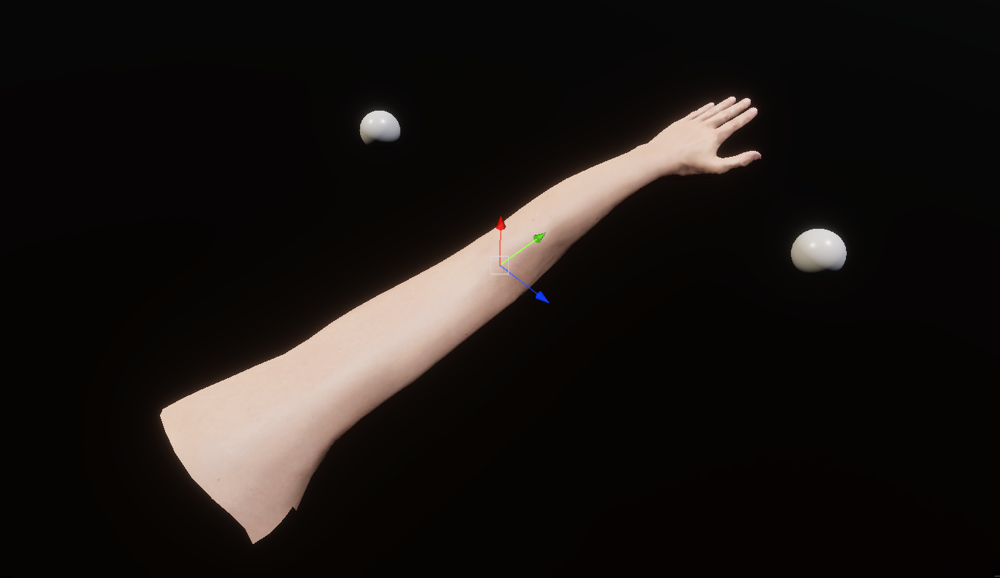

## Alternative solution for Inverse Kinematic

https://github.com/user-attachments/assets/59a24206-2fa4-41da-b289-b50a193cc65a

#### Simple IK is my alternative to popular Inverse Kinematics systems, designed specifically for seamlessly overriding animations with minimal interference. This makes it a great choice for anyone looking to add Inverse Kinematics to standard animations effortlessly.

---

### In my case (hands imported from Blender), the object has swapped axes and is rotated by (0, -90, -90). so UP is now FORWARD, RIGHT is now UP, and FORWARD is now RIGHT 